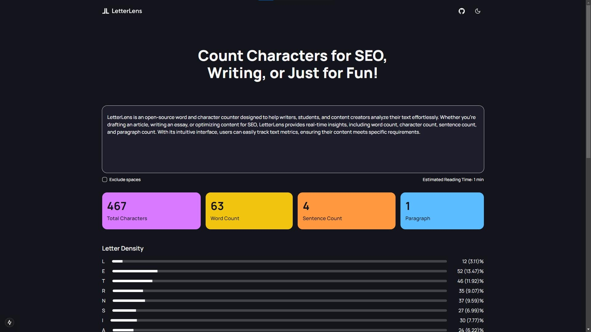

[](https://letter-lens.netlify.app)

# LetterLens 🔍

### Count Smarter, Write Better.

LetterLens is an **open-source text analysis tool** that provides real-time insights into your writing. Whether you're tracking word count, character count, sentence density, or reading time, LetterLens helps you fine-tune your content with precision.

[](LICENSE)
[](https://github.com/HardikGohilHLR/letter-lens/stargazers)
[](https://github.com/HardikGohilHLR/letter-lens/issues)

## 🚀 Features

- **Real-time Word & Character Count**: Analyze your text instantly.
- **Sentence & Paragraph Analysis**: Structure your writing efficiently.
- **Letter Density Calculation**: Understand how frequently each letter appears.
- **Reading Time Estimation**: Gauge how long it takes to read your content.
- **Dark & Light Mode Support**: Seamless UI with theme toggling.

## 🎯 Get Started

Visit [letterlens](https://letter-lens.netlify.app) to start using it instantly.

```sh
# Clone the repository
git clone https://github.com/HardikGohilHLR/letter-lens.git

# Install dependencies
npm install

# Start development server
npm run dev
```

## 🛠 Local Setup

### Prerequisites

- Node.js 18+
- npm (recommended) or pnpm/yarn

### Environment Variables

1. Copy `.env.example` to `.env.local`
2. Add required environment variables

### Run Locally

```bash
npm run dev
```

## 🤝 Contributing

LetterLens is open-source and welcomes contributions! To get involved:

- **Submit feature requests** via [GitHub Issues](https://github.com/HardikGohilHLR/letter-lens/issues)
- **Fix bugs** and submit pull requests
- **Improve documentation** and help other users

## 🌟 Need Help?

- **[Report a bug](https://github.com/HardikGohilHLR/letter-lens/issues)**
- **[Suggest a feature](https://github.com/HardikGohilHLR/letter-lens/issues)**
- **[Join discussions](https://github.com/HardikGohilHLR/letter-lens/discussions)**

## 📜 License

LetterLens is released under the [MIT license](./LICENSE).
